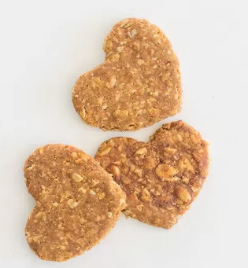

# 3 Ingredient Dog Treats Recipe

!!! tip "Source: [nourishandnestle.com.com](https://nourishandnestle.com/3-ingredient-dog-treats-recipe/)"

## Ingredients

  - [ ] 2 cups oatmeal (or a substitute grain)
  - [ ] 1/2 cup peanut butter
  - [ ] 1/2 cup soft fruit or vegetables (cooked apple, carrots, sweet potato, pumpkin or a banana)

## Instructions

1. Preheat oven to 250°
2. If using oatmeal, place it in a food processor and blend until most of the oats are ground. I left some oats whole, but you can process it as much as you want. The cookies are easier to cut if most of the oats are processed.
3. If using another grain, combine the grain, peanut butter, and fruit or vegetable in a food processor and process until the dough comes together.
4. Roll dough 1/4" thick, using flour if the dough is sticky.
5. Cut out using a cookie cutter or cut into squares.
6. Place cookies on cookie sheets and bake at 250° for 2 hours until the dog treats are completely dry and crispy.
7. Once dog treats are fully dehydrated, they can be stored at room temperature. Mine sit out at room temperature for at least a month without getting moldy, but you do need to make sure to fully dehydrate them.
