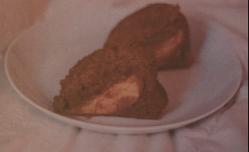

# Apple Cider Cake

## Ingredients

- [ ] 3 Cups Apple Cider
- [ ] 2 Cups (240g) flour
- [ ] 1/2 tsp baking powder
- [ ] 1/2 tsp baking soda
- [ ] 1/2 tsp salt
- [ ] 2 tsp ground cinnamon
- [ ] 1/8 tsp ground nutmeg
- [ ] 1/8 tsp ground ginger
- [ ] 4 Tablespoons earth balance or other vegan butter alternative
- [ ] 1/4 Cup coconut or vegetable oil
- [ ] 1 1/4 Cups granulated sugar
- [ ] 1/4 Cup light brown sugar
- [ ] 3/4 Cup unsweetened apple sauce
- [ ] 1/2 Cup almond milk
- [ ] 1/2 Tbs lemon juice
- [ ] 1 tsp vanilla extract
- [ ] 2 Tbs apple cider vinegar
- [ ] 1 tsp vanilla extract
- [ ] 1/2 of an apple sliced into small wedges
- [ ] 1/2 Cup confectioners sugar

## Instructions

1. Preheat the oven to 350° F. 
2. Oil and flour a bundt pan and set aside. Pour the cider into a saucepan and simmer over medium to medium-high heat until reduced to 3/4 cup, about 10-15 minutes.
3. Meanwhile in a medium bowl combine the flour, baking powder, baking soda, salt, ONE teaspoon of cinnamon, nutmeg, and ginger. Whisk together then set aside. 
4. In a large bowl combine the earth balance, vegetable oil, 3/4 cup of granulated sugar and the brown sugar, and blend together using a hand or electric mixer.
5. Beat in the apple sauce, then add the lemon juice to your almond milk and either microwave it for 30 seconds, or let sit about 5 minutes until it starts to curdle.
6. In the meantime check your cider reduction, it should be ready but may need more time. Just pour it into a measuring cup to check the amount. If it's ready, set aside 1/2 cup for your glaze, then pour the other 1/4 cup of reduction into the bowl with the rest of your wet ingredients along with the almond milk and vanilla extract. Whisk until combined. 
7. Lastly add in the apple cider vinegar. Grab the dry ingredients, add them to the bowl with the wet ingredients and beat until combined. This is a relatively thin batter so don't worry about that!
8. Pour the batter into your prepared pan then arrange the apple slices on top! They're gonna bake into the bottom and get all soft and sweet and amazing. Put the cake in the oven and bake for 40-45 minutes. It's done when you poke the middle with a knife or wooden skewer and it comes out clean. If it comes out with batter on it, keep baking and check in every five minutes. The cake will continue baking after it comes out of the oven so keep an eye on it! 
9. Pull the cake out when it's ready and set it on a cooling rack or the top of your stove to chill for 10-15 minutes. 
10. Make the glaze: Whisk together the remaining 1/2 cup reduced cider with the confectioners sugar in a bowl until it's smooth, thick and glossy
11. Make the cinnamon sugar: Whisk together the remaining 1/2 cup sugar and 1 teaspoon cinnamon in a bowl.
12. Grab your cooling rack and place it on top of the cake pan, then flip it over! The cake should slip right out. If it doesn't just give it a few minutes and it will likely drop. If you have a petty cake you can grab a knife and run it around the edges to loosen it up and get it out. Let the cake cool for another ten minutes. 
13. Cover a baking sheet or your counter with a sheet of parchment impel while you wait. If you have newspaper lying around that works too, this is just to protect your counter from the mess you're about to make. Place the cake still on the cooling rack over the paper cause it's time for glaze. 
14. Take your glaze and a brush or knife and spread it all over the cake. It will soak in as you go, so make sure to use it all.
15. Finally sprinkle the cinnamon sugar on top.
