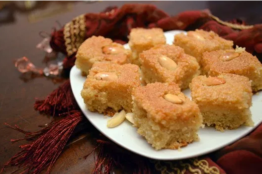

# Basbousa (Semolina Cake)

!!! tip "Source: Nada E. [onearabvegan](https://www.onearabvegan.com/2012/08/vegan-basbousa-semolina-cake/)"

## Ingredients

=== "Cake"
    - [ ] 1 Tbs tahini, for greasing pan
    - [ ] 2 cups of semolina flour
    - [ ] 1 cup of sucanat, unrefined cane sugar or coconut sugar
    - [ ] 1 tsp of vanilla
    - [ ] 1 tsp baking powder
    - [ ] Pinch of sea salt
    - [ ] 3/4 cup coconut oil or vegetable ghee ( I used half and half)
    - [ ] 1/4 cup soft tofu (silken is best)
    - [ ] 1 cup unsweetened soymilk
    - [ ] Blanched halved almonds for garnish
    - [ ] 3/4 - 1 cup agave syrup as needed
=== "Syrup"
    - [ ] 1 cup of agave syrup
    - [ ] 1 cup of water
    - [ ] 1/2 tsp arrowroot or cornstarch
    - [ ] a squeeze of lemon juice
    - [ ] optional: 1 tbsp stevia for a sweeter syrup

## Instructions

1. Pre-heat oven to 180 C (350 F) and grease a cake pan with tahini.
2. In a large bowl combine semolina, sugar, vanilla, baking powder. Stir in the melted coconut oil or vegetable ghee.
3. 0In a blender or food processor mix the tofu, soy milk and vanilla till blended and smooth. Pour into the rest of the mixture and mix well.
4. Pour batter into prepared cake pan and smooth surface using a spatula.
5. Bake for 15 mins then arrange almonds on top in rows so that when the cake is cut an almond is centered on each piece. Gently press almonds into the cake top then return cake pan to oven and bake for 20 mins or until the top is golden.
6. Remove cake pan from oven, turn off the oven, pour warm syrup over cake and return to oven then close the door half-way and let the cake/oven cool.
7. Cut into diamond shapes or squares before serving.
