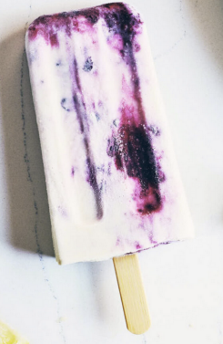

# Blackberry Cheesecake Popsicles

!!! tip "Source: [evergreen kitchen](https://evergreenkitchen.ca/blackberry-cheesecake-popsicles/)"

## Ingredients

=== "Cheesecake Base"
    - [ ] ½ cup raw cashews, soaked and rinsed (see note 1)
    - [ ] ¾ cup full-fat coconut milk (from a can)
    - [ ] 3 tablespoons + 2 teaspoons maple syrup
    - [ ] 3 tablespoons lemon juice
=== "Blackberry Swirl"
    - [ ] 1 cup blackberries (see note 2)
    - [ ] 1 teaspoon maple syrup
    - [ ] 1 teaspoon lemon juice

## Instructions

1. Blend Cheesecake Base: In a blender, combine soaked cashews, coconut milk, maple syrup, and lemon juice. Blend until completely smooth (at least 1 minute. Set aside.
2. Make Blackberry Swirl: In a medium bowl, gently mash blackberries, maple syrup, and lemon juice together. (`I like to keep some of the blackberries chunky for texture, but mash it as smoothly as you'd like). Taste and add more maple syrup if needed.
3. Assemble: Spoon some blackberry swirl into the bottom of each popsicle mold. Divide the cheesecake base and any remaining blackberry swirl into the molds, alternating for a marbled look. (Leave a bit of headroom in each mold, as the liquid will expand slightly as it freezes). Freeze until set. 

!!! info "Notes"
    1. How to soak cashews: Cashews should be soaked until soft when squeezed between your fingertips. To soak cashews, either cover them with boiling water (soak for about 30 minutes) or cover them with room temperature water (soak for 6 to 8 hours).
    2. Blackberries: Fresh, sweet (ripe) blackberries recommended. Otherwise, substitute with frozen blackberries. If using frozen, make sure they're defrosted before using.
    3. Yield: One batch (1x) makes about 2.25 cups of liquid (about 6 popsicles). Yield may vary depending on the size of your popsicle mold.