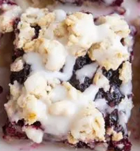

# Blackberry Cheesecake Popsicles

!!! tip "Source: [The Roasted Root](https://www.theroastedroot.net/vegan-blackberry-pie-bars/)"

## Ingredients

=== "Blackberry Filling"
    - [ ] 3 cups fresh blackberries 
    - [ ] 2 Tbsp granulated sugar or pure maple syrup 
    - [ ] 2 Tbsp gluten-free all-purpose flour*	
    - [ ] Pinch sea salt 
=== "Shortbread Crust and Topping"
    - [ ] 1 ¼ cups gluten-free all-purpose flour	
    - [ ] 1 cup gluten-free rolled oats	
    - [ ] ½ cup coconut oil, melted** 
    - [ ] 1/4 cup granulated sugar or pure maple syrup** 
    - [ ] Pinch sea salt 
=== "Optional Glaze"
    - [ ] 1 cup powdered sugar 
    - [ ] 2 Tbsp water or lemon juice 

## Instructions

1. Preheat the oven to 350 degrees Fahrenheit and line an 8” x 8” square baking dish with parchment paper.
2. Add all of the ingredients for the crust and topping to a large mixing bowl and stir well until everything is combined and a thick dough forms. The dough should be somewhat crumbly and not over oily. Measure out ½ cup of the mixture and set it aside for later to reserve as the crumble topping.
3. Transfer the remaining crust mixture to the parchment-lined prepared 8-inch pan and press it into an even layer.
4. Use a fork to poke several holes into the crust, allowing the crust to bake evenly. Bake the crust for 15 to 20 minutes, or until it is just slightly golden brown.
5. Make the blackberry filling
    1. While the crust is baking, prepare the blackberry filling mixture. To do so, transfer the blackberries, 2 tablespoons of water, and the granulated sugar (or pure maple syrup) to a saucepan. Cover the pan with a lid and heat it on the stove top over medium-high heat. 
    2. Allow the mixture to come to a full boil, stirring occasionally, and cook until the blackberries are very soft and much liquid is seeping out, about 8 to 10 minutes. Mash the blackberries using a spoon or fork until they reach your desired texture. Stir in the gluten-free all-purpose flour (or tapioca flour or cornstarch) and continue cooking without the lid until the blackberry filling is nice and thick, about another 2 to 3 minutes.
6. Make the bars
    1. Once the crust is out of the oven, pour the blackberry filling mixture over it and spread it evenly over the crust to form the blackberry layer.
    2. Sprinkle the reserved oatmeal crumble mixture on top. Bake for 25 to 32 minutes, or until the filling is thick and jammy and the topping is slightly golden-brown.
    3. Remove the blackberry oatmeal bars from the oven and allow them to cool completely before slicing and serving.
    4. If desired, make the optional glaze by stirring the powdered sugar and water (or lemon juice) together in a small bowl. Drizzle over the oat bars and enjoy!

!!! info "Notes"
    *You can replace the GF all-purpose flour in the blackberry filling with tapioca flour or cornstarch.

    **If you’re using butter instead of coconut oil, use just 1 cup of GF all-purpose flour instead of 1 ¼ cups.

    ***If using pure maple syrup to sweeten the crust, add an additional 3 tablespoons of gluten-free all-purpose flour.

    Store any leftover oatmeal bars in an airtight container in the refrigerator for up to 5 days. You can also freeze the bars in a zip lock bag for up to 3 months.
