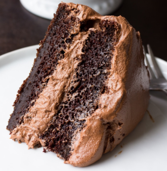

# Chocolate Cake

!!! tip "Source: [noracooks.com](https://www.noracooks.com/vegan-chocolate-cake/)"

## Ingredients

=== "Chocolate Cake"
    - [ ] 1 Cup unsweetened almond milk
    - [ ] 1 Tbs apple cider vinegar
    - [ ] 2 Cups all purpose flour
    - [ ] 1 3/4 Cups granulated sugar
    - [ ] 3/4 Cup cocoa powder
    - [ ] 2 tsp baking powder
    - [ ] 1 1/2 tsp baking soda
    - [ ] 1 tsp salt
    - [ ] 1/2 Cup canola oil OR melted coconut oil
    - [ ] 2/3 Cup unsweetened applesauce
    - [ ] 1 Tbs pure vanilla extract
    - [ ] 1 Cup boiling water
=== "Chocolate Buttercream Frosting"
    - [ ] 1 Cup cocoa powder
    - [ ] 1 1/2 Cups earth balance vegan butter, softened baking sticks preferred
    - [ ] 4-5 Cups powdered sugar
    - [ ] 2 tsp pure vanilla extract
    - [ ] 1/4-1/2 Cup unsweetened almond milk

## Instructions

=== "Chocolate Cake"
    1. Preheat oven to 350 degrees F and grease two 9-inch cake pans. I also line them with parchment rounds and lightly flour for easy removal of the cakes later.
    2. Measure 1 cup unsweetened almond milk and add the tablespoon of vinegar to it. Stir slightly and set aside to curdle.
    3. In a large bowl, add the flour, sugar, cocoa powder, baking powder, baking soda and salt. Whisk well to combine.
    4. Now add the oil, applesauce, vanilla and almond milk/vinegar mixture. Mix on medium speed with a hand mixer (or stand mixer with the paddle attachment) until well combined. 
    5. Lower the speed and carefully pour in the boiling water, continuing to mix into the cake batter until combined. The batter will seem very runny at this point; that is how it should be, trust me!
    6. Divide the batter evenly between your cake pans. Bake for 30-35 minutes, or until a toothpick inserted in the center comes out clean. After 10 minutes of cooling in the pan, carefully remove the cakes from the pans and let cool completely before frosting.
=== "Chocoalte Buttercream Frosting"
    1. Add the cocoa powder to a large bowl (I just wipe out the cake bowl and use it for the frosting). Whisk well to remove any clumps.
    2. Add the softened vegan butter and mix with a hand mixer until creamed and well combined.
    3. Add half of the powdered sugar and half of the almond milk, and mix until combined. Add the rest of the powdered sugar and vanilla extract. Mix starting on low, and turn to high. Mix until fluffy and combined.
    4. If the frosting seems too dry, add more milk, a tablespoon or two at a time. If the frosting seems too wet and doesn't hold it's shape, add more powdered sugar until it thickens up. 
    5. Frost the cake using an icing spatula or just a butter knife.