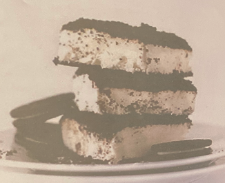

# Dirt Cake

## Ingredients

- [ ] 2 cups unsweetened vanilla almond or soy milk
- [ ] 1/3 cup sugar
- [ ] 3 Tbsp cornstarch
- [ ] 1 cup + 3 Tbsp powdered sugar, divided
- [ ] 8 ounces vegan cream cheese
- [ ] 1 can full-fat coconut milk, chilled overnight
- [ ] 1 16.6 ounce pack of Oreos (Double Stuf or regular)

## Instructions

1. First make sure your coconut milk has been chilling in the fridge overnight or at least 8 hours. This will allow it to harden enough to whip into whipped cream. 
2. Prepare pudding by adding cornstarch and sugar to a small saucepan and whisking in almond or soy milk to avoid clumps. Cook over medium heat until it thickened and bubbling, stirring frequently. Then reduce heat to low and cook for 4-6 more minutes, using a rubber spatula to scrap the sides and bottom almost constantly. Once it appears "jiggly" and a visible ribbon forms when you drizzle some over the top with your spatula, remove from heat and let cool 10 minutes. Then transfer to a glass or ceramic bowl and cover with plastic wrap. Refrigerate until set - 2-3 hours. At the same time, place a glass bowl in the freezer for your coconut whipped cream., 
3. When your pudding is almost set, whip your coconut whipped cream. Remove can from fridge, being careful not to shake or turn it and remove top. Gently scoop out the top hardened "cream" into the chilled bowl, leaving the liquid watery part behind. You can use this for smoothies or in baking, if you wish. Otherwise discard it. 
4. Use a handheld mixer to whip the coconut cream until it begins to look like whipped cream - about minute. Then add 3 Tbsp powdered sugar. Beat again until light and airy - about 2-3 minutes. Set in fridge. 
5. In a separate bowl whip the "cream cheese" until light and airy, then add in the remaining 1 cup powdered sugar 114 cup at a time. By this time the pudding should be set. Add this to the cream cheese mixture and beat until well combined. Next fold in coconut whipped cream until incorporated. Set in fridge. 
6. In the meantime, pulverize your Oreos in a food processor or with a rolling pin and plastic bag. 
7. Spread half of the crumbs on the bottom of a 9x13 and tap on the counter to settle. Then pour over your cream mixture (see gif photo), and smooth with a spoon. 
8. Top with the other half of the crumbs and chill in the refrigerator for 6-8 hours or overnight. You can also freeze this for more of an ice-box texture, which I did for photos. However, I prefer the refrigerator chilled-version because its softer and not icy. Will keep in the fridge for several days, or in the freezer for a couple of weeks. Notes *Freeze cake if you prefer more of an icebox-type texture. Otherwise, just chill in the fridge for 6-8 hours until completely set and chilled. If you freeze it you can slice it more into squares. If you refrigerate it, it's more of a scooping situation. Either way is delicious, but I prefer the taste/texture when it's refrigerated and not frozen. 