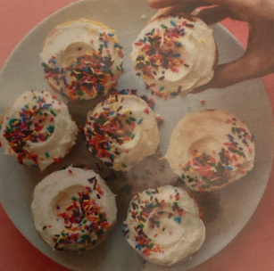

# Funfetti Cupcakes

## Ingredients

=== "Cupcakes"
    - [ ] 1 Cup milk + 1 tsp Apple Cider Vinegar
    - [ ] 1/2 Cup (1 stick) Vegan Butter, softened
    - [ ] 1 Cup granulated Sugar
    - [ ] 1 tsp Pure Vanilla Extract
    - [ ] 1 1/2 Cups unbleached all-purpose flour
    - [ ] 1 1/2 tsp Baking Powder
    - [ ] 1/2 tsp Baking Soda
    - [ ] 1/4 tsp Salt
    - [ ] 1/3 Cup Rainbow Sprinkles* + more for topping
=== "Frosting"
    - [ ] 1/2 Cup (1 stick) vegan butter, softened
    - [ ] 2 1/2 - 3 Cups Powdered Sugar
    - [ ] 1 1/4 tsp Vanilla Extract
    - [ ] Splash of Milk

## Instructions

1. Preheat oven to 350 degrees F (176 C) and line a standard muffin holder with 12 paper liners.
2. In a liquid measuring cup, measure out non-dairy milk and add vinegar or lemon juice. Let set to curdle/activate.
3. Add softened butter to a large mixing bowl and cream with a mixer. Then add sugar and vanilla and beat until combined and fluffy - about 2 minutes.
4. Add dry ingredients (omitting sprinkles) to a sifter in this order: 1 cup flour, baking soda, baking powder, salt, and then remaining 1/2 cup flour.
5. Sift over butter/sugar mixture alternating with the almond milk mixture. Blend until until well incorporated and no large lumps remain.
6. Add sprinkles and gently fold/stir with a rubber spatula or mixing spoon.
7. Divide evenly among cupcake holders making sure NOT to overfill. These do best 314 of the way up.
8. Bake on a center rack for 20-24 minutes, or until a toothpick inserted into the center comes out clean. They will only have a very, very slight golden brown color.
9. Let cool completely on a cooling rack. In the meantime, prepare frosting.
10. Wipe clean your mixing bowl and add softened butter. Beat until light and fluffy. Then add vanilla and mix once more.
11. Add powdered sugar 1/2 cup at a time and continue mixing until thick and creamy. Drizzle in a little non-dairy milk to thin. You want this frosting to be very thick so it will hold its shape once on the cupcakes.
12. Once cooled, frost cupcakes and top with sprinkles. Serve immediately. Store avers covered at room temperature or refrigerated.