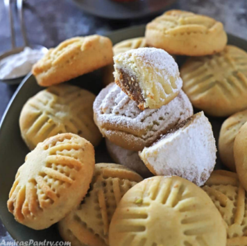

# Maamoul

!!! tip "Source: [Margarita @ Tasty Mediterraneo](https://www.tastymediterraneo.com/vegan-maamoul/)"

## Ingredients

=== "Cookie Dough"
    - [ ] 300g (1 1/2 cup) Semolina
    - [ ] 200g (1 cup) Thin semolina
    - [ ] 250m1 (1 cup) Extra virgin olive oil
    - [ ] 50m1 (1 1/4 cup) Hot water
    - [ ] A pinch of sea salt
    - [ ] 1/2 teaspoon mahlab
    - [ ] 1 teaspoon natural rose water
    - [ ] 1 teaspoon orange blossom water
=== "Date Filling"
    - [ ] 150g (1 cup) Unpitted dates
    - [ ] A pinch of freshly ground nutmeg
    - [ ] 1 teaspoon water
=== "Pistachio Nut Filling"
    - [ ] 100g (1 cup) Unshelled pistachios
    - [ ] 1 teaspoon muscovado sugar
    - [ ] 1/2 teaspoon orange blossom water
=== "Walnut Filling"
    - [ ] 100g (1 cup) Unshelled walnuts
    - [ ] 1 teaspoon unrefined muscovado sugar
    - [ ] 1/2 teaspoon orange blossom water

## Instructions

=== "Cookie Dough"
    1. In a large bowl add the semolina and thin semolina, the pinch of salt and the mahlab and mix it all well until combined. Add the EVOO and mix well with the dried ingredients. Add then the rose water, the orange blossom water and the hot water and work it all with your hands very gently. At first you will get clumps, then the dough will start to come together. You are not aiming for a smooth dough but for a dough that comes together and is slightly homogenous. You should work the dough with your hands for about 15-20 minutes
    2. Cover the bowl and allow the dougn to rest for at least 1 hour. Then remove the dough from the bowl, roll the dough into 2 long kind of sausages shape and cover with cling film. Allow them to rest over night (or for a minimum of 4 hours). The next day remove the cling film from the dough and cut off small pieces (see my step-by-step pictures for guidance)
=== "Date Filling"
    1. Cut the unpitted dates into very small pieces and add them into a bowl. Add the pinch of freshly ground nutmeg and a teaspoon water and with the help of a blender, mix it all until you obtain a paste
    2. Roll the date paste with your hands into small walnut size balls
=== "Pistachio FIlling"
    1. Mix the pistachios, sugar and orange blossom water
=== "Walnut Filling"
    1.  Mix the walnuts, sugar and orange blossom water
=== "Final Preperation"
    1. Cut off small pieces of the dough. Do not worry if it crumbles a bit between your fingers, to avoid that my tip is to have your hands wet with water every time you are making a cookie. Flatten each piece of dough with your hands, form a hollow (see my step by step pictures for guidance) and stuff in the middle of it the filling of your choice. Then close carefully until you have a filled dough ball. Repeat the process with the rest of the dough
    2. If you have the maamoul molds press each of the filled dough balls inside them (the molds should be previously lightly greased with EVOO to avoid the cookie to stick to it), push the dough a bit inside the mold to make sure it gets the shape and then tap the tip of the mold against your working surface with a firm quick movement. To avoid them to crumble, when I release them from the mold I do it directly over ovenproof paper that I have previously added to my working surface. Like this I avoid having to touch them when putting them on the baking tray, and thus there is less risk of them to crumble
    3. If you do not have the maamoul molds do not worry, you can bake them without shaping them. Just make the stuffed cookies into balls and flatten them slightly. Their shape won't change their taste! And if you want you can decorate them a bit with the help of a fork
    4. Preheat the oven to 175 degrees C (350 degrees F). Bake in the middle of the preheated oven for 10-12 minutes. Remove from the oven and allow them to cool on a cooling rack

!!! info "Notes"
    If you keep the maamoul in an airtight container in the fridge they can perfectly last for up to I. month. 

!!! info ""
    Once the cookies are cold, you can add a small dusting of powdered sugar over the pistachio and walnut stuffed maamoul. Usually you don't add any powdered sugar over the date stuffed maamoul since they are already sweet enough.