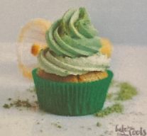

# Matcha Cupcakes 

## Ingredients

=== "Cupcakes"
    - [ ] 1 1/4 cup (160g) all-purpose flour
    - [ ] 2 tsp. baking powder
    - [ ] 1/2 cup (120g) brown sugar
    - [ ] pinch of salt
    - [ ] 1/4 cup (60m1) vegetable oil
    - [ ] 3/4 cup (175m1) coconut rice milk (or soy milk)
    - [ ] 1 tsp vanilla extract
    - [ ] 1 tbsp apple vinegar
    - [ ] 1-2 tsp matcha (or more if you like)
=== "Matcha Buttercream"
    - [ ] 5.3 oz. (150g) vegan butter (aka. margarine), at room temperature
    - [ ] 10.5 oz.(300g) confectioner's sugar
    - [ ] 1 tsp vanilla extract
    - [ ] 1-3 tsp matcha (depends on how green you want it)

## Instructions

1. Preheat the oven to 350"F (175°C). Prepare a muffin tin with paper liners and set aside. In a mixing bowl combine the flour, baking powder, salt and brown sugar. Add oil, coconut rice milk, vanilla extract, vinegar and matcha. Mix until all is well combined. The batter will be quite runny, but that is fine. Fill the paper liners about 2/3 full and bake for 18-20 minutes or until a toothpick inserted in center comes out clean. Take out of the oven and let cool down in the muffin tin for couple minutes and then transfer to a wire reack and let cool completely.
2. For the buttercream add the vegan butter to a mixing bowl and beat on high speed until light and fluffy - about 5-8 Minutes. Add the confectioner's sugar in three batches and mix until well combined. Add the vanilla extract and 1-2 teaspoons of matcha and mix well. Fill about 2/3 of the frosting into a piping bag with a star tip and frost the cupcakes with one layer. Add another teaspoon of matcha to the remaining frosting and mix again until well combined. Fill into the piping bag (you should wash it before) and pipe a swirl on top of each cupcake. Dust with some matcha powder (optional). 