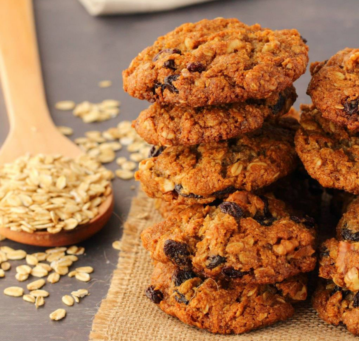

# Oatmeal Raisin Cookies

!!! tip "Source: [Loving It Vegan](https://lovingitvegan.com/vegan-oatmeal-raisin-cookies/)"

## Ingredients

- [ ] 1/2 cup (112g) Vegan Butter
- [ ] 1 cup (200g) Brown Sugar
- [ ] 1 Tbsp Golden Syrup*
- [ ] 1 Tbsp Dark Molasses
- [ ] 1 Tbsp Vanilla Extract
- [ ] 1 and 1/2 cups (144g) Rolled Oats
- [ ] 1 cup (125g) All Purpose Flour
- [ ] 1 cup (80g) Dessicated Coconut
- [ ] 1 tsp Baking Soda
- [ ] 1/2 tsp Salt
- [ ] 1 tsp Cinnamon
- [ ] 2 Tbsp Soy Milk (or other non-dairy milk)
- [ ] 3/4 cup (105g) Raisins (small and seedless)
- [ ] 1/2 cup (64g) Chopped Walnuts*

## Instructions

1. Add the vegan butter and brown sugar to the bowl of an electric mixer and cream them together. Add in the golden syrup, molasses and vanilla and mix in.
2. Add the rolled oats, all purpose flour, dessicated coconut, baking soda, salt and cinnamon to a mixing bowl and mix together.
3. Add the dry ingredients in with the wet and mix in (by hand, don’t use the electric mixer for this part) until crumbly.
4. Add in the soy milk and mix again. Your dough should be very thick, but you should be able to roll it into a ball and have it stick together perfectly at this stage.
5. Add in the raisins and chopped walnuts and mix in.
6. Preheat the oven to 350°F (180°C) and line a baking tray with parchment paper.
7. Roll the dough into balls and place onto the parchment lined baking tray. Aim to get around 20 cookies. Try to ensure the raisins are spread out in the cookie dough so that you don’t end up with some cookies having no raisins and some cookies having a lot of raisins.
8. Place into the oven and bake for 15 minutes.
9. The tops will be golden brown and the edges firm but the cookies will be very soft in the middle.
10. Allow the cookies to cool on the baking tray and firm up before moving them.