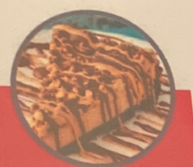

# Peanut Butter Pie

## Ingredients

=== "Orea Cookie Crust"
    - [ ] 28 Oreos (crushed)
    - [ ] 1/3 cup (75g) Vegan Butter (Melted)
=== "Peanut Butter Center"
    - [ ] 1 12oz (340g) Tub of Creamy Salted Peanut Butter
    - [ ] 1 14oz (400g) Can Coconut Cream (chilled overnight)
    - [ ] 1 cup (120g) Powdered (Confectioners) Sugar
=== "Topping"
    - [ ] 1 14oz (400g) Can Coconut Cream (chilled overnight)
    - [ ] 2 Tbsp Cocoa
    - [ ] 2 Tbsp Powdered Sugar
=== "Decoration (Optional)"
    - [ ] Melted Peanut Butter (drizzled)
    - [ ] Melted Vegan Chocolate (drizzled)
    - [ ] Crushed Peanuts

## Instructions

1. Crush the oreo cookies in a food processor or by placing in a ziplock bag and crushing with a rolling pin. Melt the vegan butter and mix in with the oreo cookie crumbs in a bowl until properly mixed.
2. Spray a pie dish with non-stick spray and then pat down the oreo crust, working up the sides a little bit. Place into the freezer to set while you work on the filling.
3. Remove one can of coconut cream from the fridge. Open it and you'll see the cream has risen to the top and hardened a bit. Scoop out only this cream section at the top into the mixing bowl of an electric mixer, leaving the watery part behind.
4. Starting at slow speed, gradually increase s, ed until the cream s whipped. Check out our full tutorial here.
5. Scoop out the jar of peanut butter and add it to the whipped cream along with the powdered sugar and mix together on low speed until properly mixed.
6. Pour this out over the top of the oreo cookie crust and smooth out. Place back into the freezer to set.
7. Remove the second can of coconut cream from the fridge and repeat the process of whipping it up into whipped cream. Add the cocoa powder and powdered sugar and whir again.
8. Pipe the chocolate cream out onto the edges of the pie. Any chocolate cream leftove-s can be saved for serving.
9. Decorate the pie with drizzles of melted peanut butter and melted vegan chocolate and crushed peanuts.