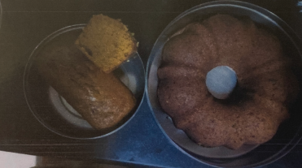

# Pumpkin Cake

## Ingredients

- [ ] 1 Cup Brown Sugar
- [ ] 1/2 Cup Vegetable Oil
- [ ] 1/2 Cup Maple Syrup
- [ ] 1 tsp Vanilla Extract
- [ ] 2 1/2 Cups Flour
- [ ] 1 tsp Baking Powder
- [ ] 1 tsp Baking Soda
- [ ] 1 tsp Cinnamon
- [ ] 1 tsp Ground Cloves
- [ ] 1/2 tsp Ginger
- [ ] 1/2 tsp Nutmeg
- [ ] 1/2 tsp Salt
- [ ] 1 (15 Ounce) can of Pumpkin (or 2 Cups fresh pumpkin cooked and mashed)

## Instructions

1. Preheat oven to 375 F
2. Grease an 8x8 baking pan.  Line the bottom with parchment paper
3. Place sugar, oil, syrup, and vanilla in a large mixing bowl. Whisk until sugar is dissolved
4. In a separate bowl, sift together the flour, spices, and salt
5. In small alternating poritions, add the flour mixture and pumpkin to the liquid ingredients. Begin and end with the flour mixture
6. Spread the batter into the prepared pan
7. Bake 55 minutes to an hour