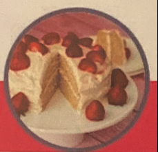

# Vanilla Cake

## Ingredients

=== "Vanilla Cake"
    - [ ] 1 and 3/4 cups (220g) All-Purpose Flour
    - [ ] 1 cup (200g) Sugar
    - [ ] 1 tsp Baking Soda
    - [ ] 1/2 tsp Salt
    - [ ] 1 cup (240m1) Soy Milk (or other non-dairy milk)
    - [ ] 2 tsp (10m1) Vanilla Extract
    - [ ] 1/3 cup (80m1) Olive Oil (or other vegetable oil)
    - [ ] 1 Tbsp (15m1) White Vinegar (or Apple Cider Vinegar)
=== "Vanilla Frosting"
    - [ ] 3 and 3/4 cups (450g) Powdered Sugar
    - [ ] 3 Tbsp Vegan Butter
    - [ ] 4 Tbsp Soy Milk (or other non-dairy milk)
    - [ ] 2 tsp Vanilla Extract
=== "Decoration"
    - [ ] Fresh Strawberries 

## Instructions

1. Preheat the oven to 350 degrees Fahrenheit (180 degrees celsius)
2. Sift the flour into a mixing bowl.
3. Add the sugar, baking soda and salt and mix together.
4. Add the soy milk, vanilla, olive oil and vinegar and whisk it in.
5. Grease two 7 inch round cake tins with coconut oil and cut parchment paper into circles to fit the bottoms and then divide the mixture evenly between them.
6. Bake for 30 minutes.
7. Remove from the oven and using a toothpick, insert into the center of the cake. If it comes out clean then your cake is done.
8. Move to a cooling rack to cool completely.
9. Prepare your frosting.
10. Add the powdered sugar, vegan butter, vanilla and soy milk.
11. Beginning on low speed, mix with an electric mixer, slowly increasing speed until it is smooth and creamy.
12. If your frosting is a little thin, add more powdered sugar, if it's a little thick, add more soy milk. The consistency must be thick enough that it doesn't slide off the cake, but thin enough to be spreadable.
13. When your cake is completely cool, add frosting to the top of one of the layers.
14. Add the second layer on top and frost it completely, using a knife to carefully frost the sides of the cake.
15. Decorate with fresh strawberries and serve right away.
16. If you're not serving right away, then omit the strawberries or serve them on a plate alongside the cake, so it doesn't get soggy. 

## Notes

I highly recommend you weigh the flour for the best results. Flour measures are tricky, so weighing it on a food scale is the best way to ensure accuracy. The cake tins used in this recipe are 7 inches round. If you want to double this recipe just bear in mind that results are variable, it can be tricky to double a recipe and it doesn't always come out right. 

Only add fresh strawberries to this cake if you're going to be eating it right away. The strawberries are a fabulous addition to the flavor of this cake, BUT they run and can cause sogginess. So if you are keeping this cake for a few days, then either don't use strawberries at all or just add some strawberry slices directly to the individual cake slices when served. Nutrition information is based on 1 serve of 10 with a very generous amount of vanilla frosting. 
